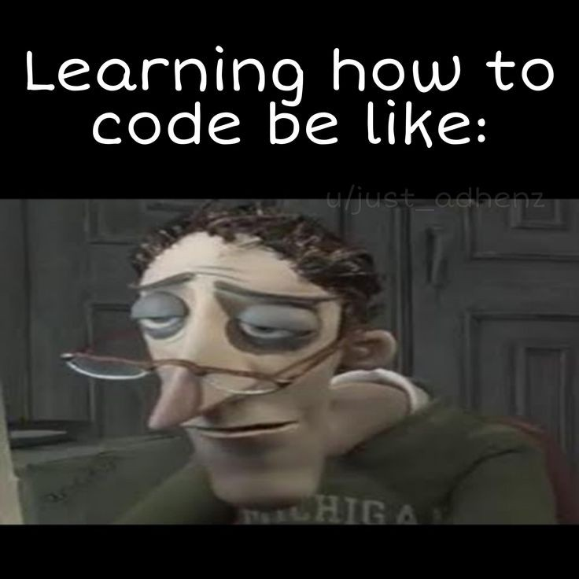

# Frontend Mentor Challenges

This is a solution to the [Huddle landing page with curved sections challenge on Frontend Mentor](https://www.frontendmentor.io/challenges). Frontend Mentor challenges help you improve your coding skills by building realistic projects. 

## Overview

### The challenge

Users should be able to:

- View the optimal layout for the site depending on their device's screen size
- See hover states for all interactive elements on the page

### All the Challenges and Projects were Built with

- Semantic HTML5 markup
- CSS custom properties
- Flexbox
- CSS Grid

### What I learned

1. Experience: I gained a lot of experience from this by doing projects that mimic real world scenarios.
2. Skill: I was able to strengthen my front end skills especially my HTML and CSS skills by doing these project based learning.
3. Soon i will also do some projects with javaScript in it when im confident enough.

### Continued development

I will start to learn mobile-first as well as continue to learn javaScript before deep diving to any projects that contain javaScript.

### Useful resources

- [MDN](https://developer.mozilla.org/en-US/) - This helped me a lot when i forgot some syntax and learn new things that i need in my project that help me to grow.

## Author

- Website - [Seth Hernandez](https://www.your-site.com)
- Frontend Mentor - [@sether31](https://www.frontendmentor.io/profile/sether31)

## About Me

Aspiring Front-end developer

<!-- ## Acknowledgments -->

